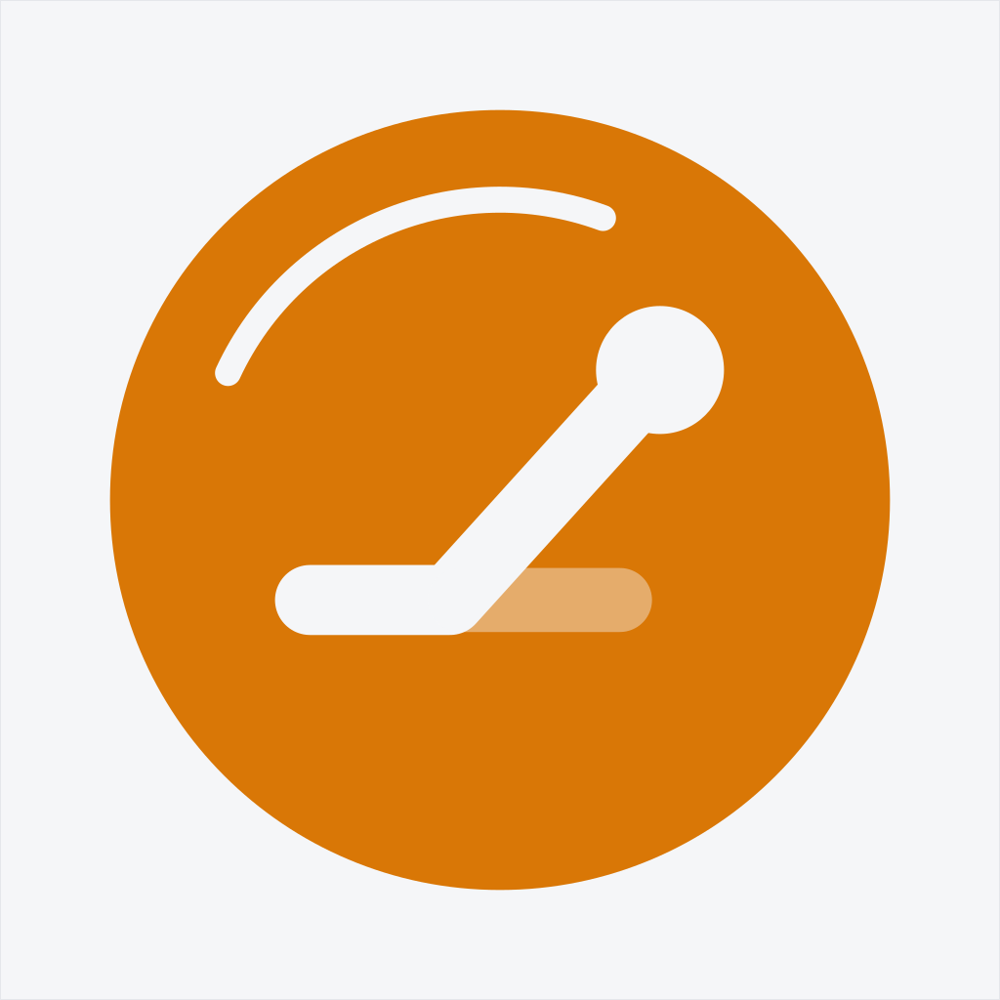

# MeetPR 品牌资产 — App 图标

**「片里的折线」** —— 一片正视的杠铃片，里面是那条走平后拐头冲上去的线；淡色那截是「本来会这样」。
左上一道白弧与下沿的 PERSONAL RECORD 同心，一上一下把圆盘箍住。外形对称，方向留在内部。两个颜色、一个形状。

David 2026-07-30 定稿。本目录是唯一图形真源；改图标先改这里的 SVG，再重出 PNG。

## 文件

| 文件 | 用途 |
|---|---|
| `app-icon.svg` | 主图矢量源（1024 画板，Archivo 已内嵌为 woff2，自包含，无外部依赖） |
| `app-icon-tinted.svg` | iOS tinted 外观用的灰度挖空版矢量源 |

派生产物（不手改，从上面两个 SVG 重出）：

- `MeetPR/Assets.xcassets/AppIcon.appiconset/meetpr-icon-1024.png` — 主图
- `…/meetpr-icon-1024-dark.png` — 深色外观，当前与主图同一张（纸底 + 金盘在深色壁纸上最跳，见定稿稿的「主屏」对照）
- `…/meetpr-icon-1024-tinted.png` — 由 `app-icon-tinted.svg` 出，灰度 + 透明底，系统自己上用户色

只交一张 1024，iOS 自动派生全部尺寸，不做尺寸变体。

## SPEC

**颜色** — 底 `#F5F6F8`，圆盘 `#D97706`，盘内所有形状都是底色 `#F5F6F8`；淡段 = 底色 42%。
全图两色，不加渐变、不加阴影。

**圆盘** — 圆心 (50%, 50%)、半径 39%。圆盘本身就是安全区内的对称主体，四边各留 11%。

**折线** — stroke 7%、round 端头与接头；起点 (31%, 60%)、折点 (45%, 60%)、终点 (64%, 39%)；
终点圆点 r 6.4% 压在线头上。

**淡段** — 从折点向右 (46%→62%, y=60%)、stroke 6.4%、底色 42%，不越过终点圆点。

**上下两弧** — 同心：上弧 r 30%、跨 85°（205°→290°）、宽 2.6%、圆头；下弧同 r 30%，
走 PERSONAL RECORD（Archivo 700 / 4.6%、字距 .5、居中，字长 ≤ 弧长）。

**画板** — 1024×1024 无圆角、无 alpha，系统自套 squircle。浅底成品带 1px `#E5E7EB` 内描边，
避免贴住白壁纸。⚠️ 这道描边在 1024 画板上是 1 物理像素（= 0.098 用户单位），实际显示尺寸下看不见，
按定稿字面保留；真要在浅壁纸上脱开得按比例加粗，但那样四角会被 squircle 切断，所以没做。

**交付** — 只出一张 1024（iOS 自动派生全部尺寸）+ 一份同构图的 SVG 备品牌用。
Android 432 前景（圆盘 + 盘内形状）按 .8 收一档让开自适应遮罩、底色 `#F5F6F8`
（落在 `meetpr-rn` 仓 `assets/images/`）。Watch 圆形遮罩下圆盘缩到 70% —— **本仓暂无 watch target，未实装**。

**动效**（定稿附带，尚未实装）— 启动页 / 破 PR：圆盘先淡入，淡段亮起 → 折线由左向右画出（280ms）→
终点圆点弹入（scale .8→1，`cubic-bezier(.2,.9,.1,1)`）→ 上弧顺时针扫出。与学员端「新纪录」徽标同一动作。

## 重出 PNG

SVG 里用了 `textPath` + 内嵌可变字体，只有浏览器引擎渲得准（`rsvg`/`cairosvg` 的 textPath 支持不全）。
用 headless Chrome：

```bash
cat > /tmp/r.html <<'EOF'
<!DOCTYPE html><html><head><meta charset="utf-8"><style>
html,body{margin:0;padding:0;overflow:hidden;background:transparent}
img{display:block;width:1024px;height:1024px}
</style></head><body></body></html>
EOF
cp docs/brand/app-icon.svg /tmp/ && \
"/Applications/Google Chrome.app/Contents/MacOS/Google Chrome" --headless --disable-gpu \
  --hide-scrollbars --force-device-scale-factor=1 --default-background-color=00000000 \
  --window-size=1024,1024 --screenshot=/tmp/icon.png /tmp/r.html && \
magick /tmp/icon.png -background '#F5F6F8' -alpha remove -alpha off -colorspace sRGB \
  -strip -define png:color-type=2 \
  MeetPR/Assets.xcassets/AppIcon.appiconset/meetpr-icon-1024.png
```

出完必查：`magick identify -format '%wx%h %[channels]'` 要是 `1024x1024 srgb 3.0`
（**3 通道 = 无 alpha，App Store 硬要求**；tinted 那张例外，它必须带 alpha）。
