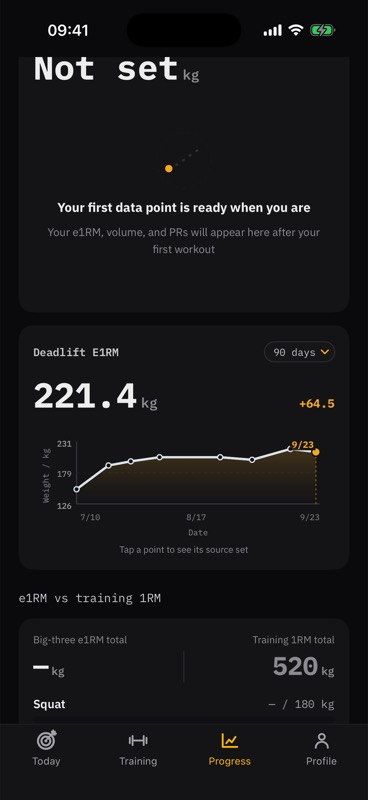
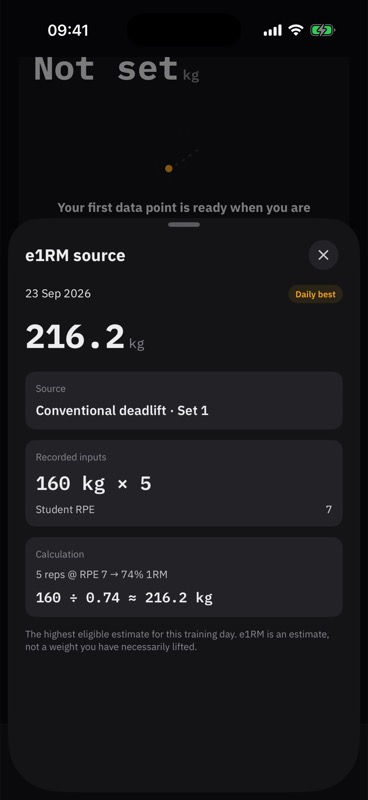

# 导入基线锁死实练 e1RM：修复验证

2026-09-27；T2 / P1；分支 `fix/050-imported-e1rm-baseline`，基底 `origin/release/1.0@abc7154d`。本次未合并、未切包，现有 `beta/1.0-22` 不含此修复。需求与范围见 [修复补充](../specs/050-e1rm-single-source/IMPORTED-BASELINE-REPAIR.md)。

## 原因与修复

去身份化重放 38 组硬拉记录：5 组 assumed/imported 的无 RPE 估算最高 151.7；首次真实 135×5@6 估算 192.9，被旧代码与导入基线比较而标 low，后续 31 组真实合格记录一直无法更新基线。2 组 10 次硬拉按既有规则不入选。计划日 9/13 的 160×5 实际日志日期为 9/23；不能把计划日期当成日志日期。

异常基线改为同主项 normal + logged；导入展示、导入复核、既有 PR 字段和 10%/18% 阈值保持。Progress 首次加载/刷新及训练刷新复用 reconciler，按真实日志重放受影响主项，保留点 ID、其他主项、退役孤立点、导入复核和既有 PR。原子版本比较拒绝过期替换；已有重量基线只增不减，保留来源和 previousMax 元数据。

## 验证

- 红→绿：首次实练 .low→.normal；旧历史 151.7 / formingWindowSparse→31 个可信实练点 / 8 个可信日期 / chart。
- StudentKit 全量 **901 tests passed**（最终日志 `swift_package_test_2026-09-27T15-11-07-088Z_pid86641_33734c86.log`，XcodeBuildMCP workspace Projects-cf51cf27789e）。
- 回归覆盖：真实异常仍隔离、已复核导入不污染基线、退役历史与缺失点组合、导入复核并发 CAS 拒写重试、真实磁盘写失败重试、Local 仓储重开首屏、重复刷新无写入、较新重量基线不回退。
- 目标 Swift 文件 strict swiftlint / swift-format 和 `git diff --check` 通过。本地验证最初复用 ViewInspector 0.10.3。PR CI 首跑在新解析的上游 ViewInspector manifest 失败（tools 5.9 使用 visionOS v2）；四个引用模块随后统一固定既有已验证版本 0.10.3，不新增依赖。
- `MeetPR-DemoStudent` / `DemoStudent`，iPhone 17 Pro 模拟器构建运行成功。用临时 Demo seed 注入同一去身份化旧历史，从 Today 151.7 直接切 Progress，90 天曲线出现；点选 9/23 显示 160×5、RPE 7、216.2。临时 Demo 源码已还原，不进入提交。
- Demo 仅证明页面接线与呈现；真实磁盘持久化由 LocalE1RMRepository 升级/重开/失败重试测试证明。未读取学员手机本地文件，不声称已在学员设备验证。

头条 221.4 是现有 28 天滚动最佳（9/15 的 155×5@6）；9/23 每日最佳为 216.2。本次没有改公式或口径。截图其他两项空态是单硬拉验证夹具的预期，训练 1RM 为 Demo 值。

## 独立审查

按 review-loop 本地双轴审查（仓内缺 tracker 配置，未冒称执行 Matt tracker 流程）：

- Standards 第 1 轮：旧 canonical 响应可能使重量 PR 基线回退。新增红测试后按最大值合并基线；第 2 轮 CLEAN。
- Spec 第 1 轮：修复同时补缺失点/coachRPE 时绕过保留逻辑，可能删除退役历史。所有分支统一按受影响主项合并，新增组合红测试；第 2 轮 CLEAN。

两个独立 reviewer 均只读，未决 blocker 0。PR / CI 状态另以 GitHub 为准。

CI 前置约束补审：Standards / Spec 均 CLEAN，仅四个既有测试依赖约束统一为 exact 0.10.3；StudentKit 901 复验通过，完整 CI 重新运行。
