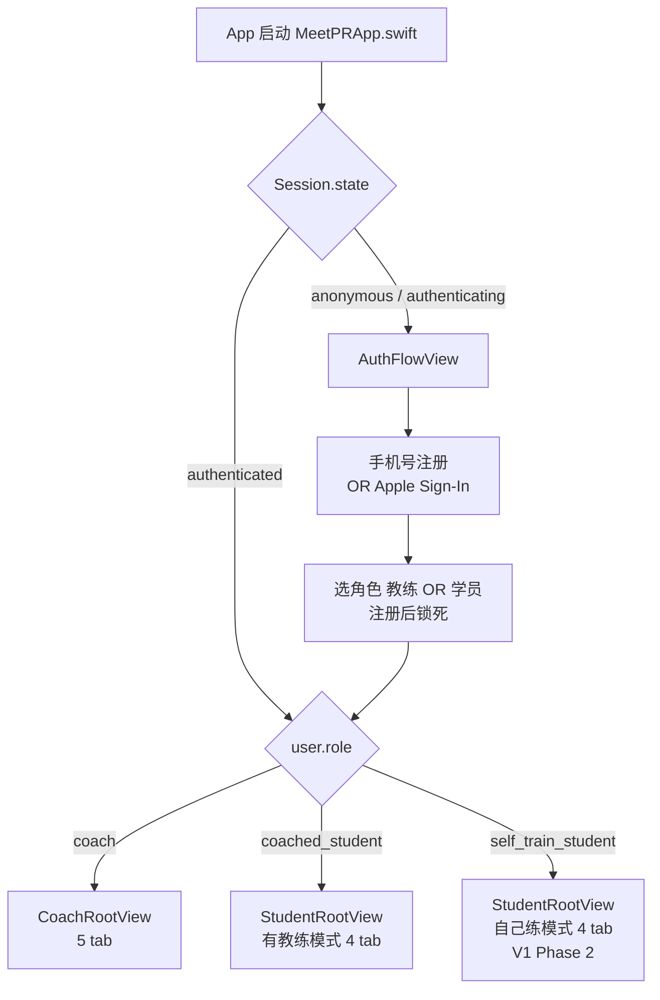
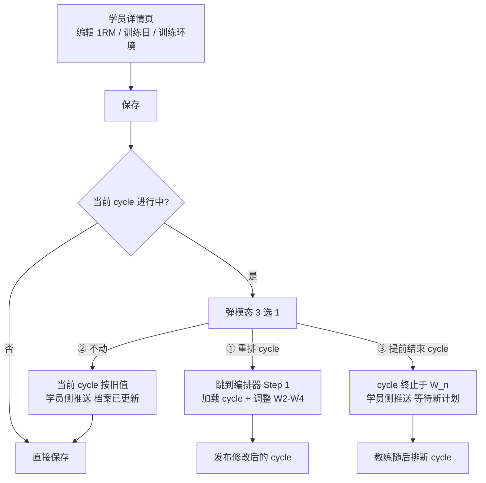
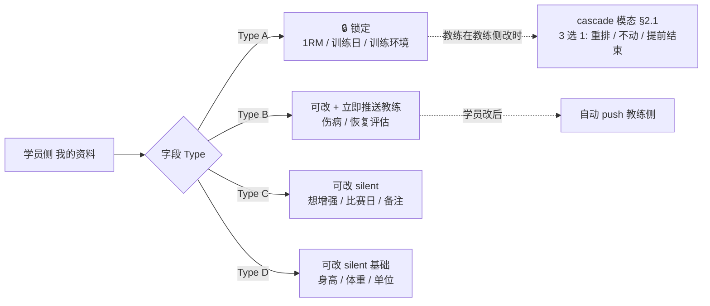
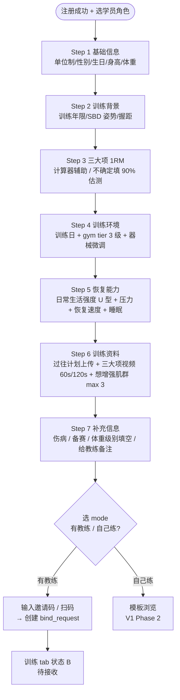
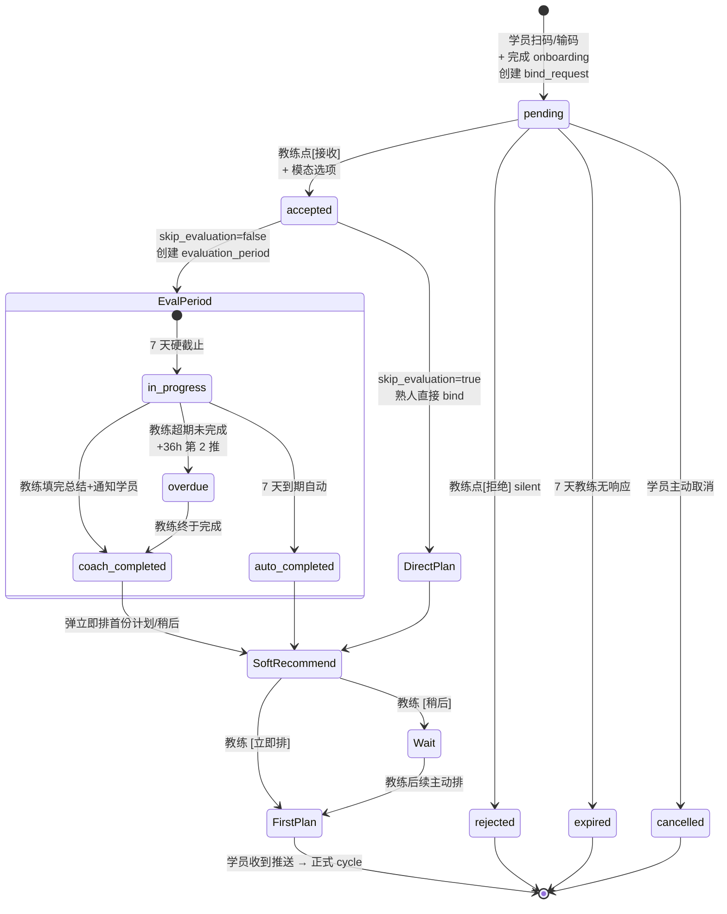
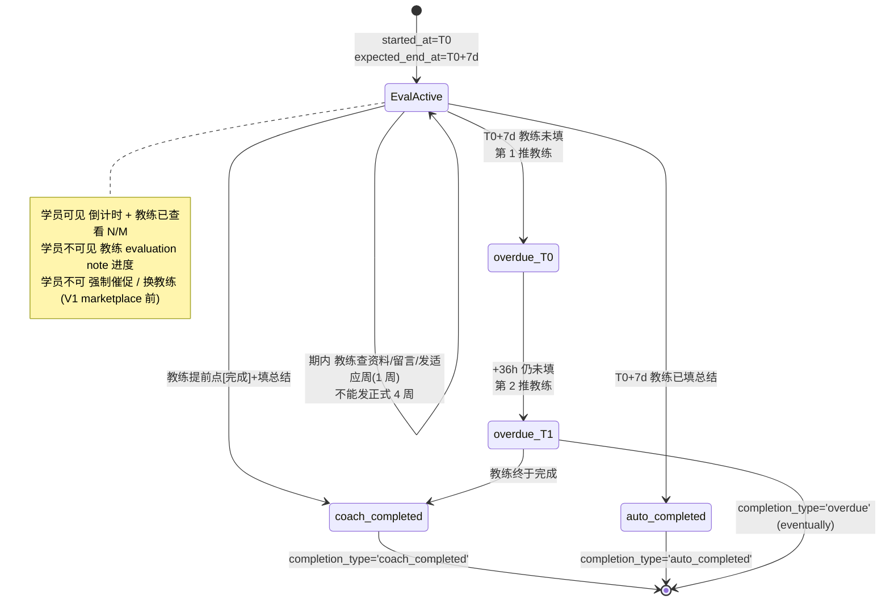
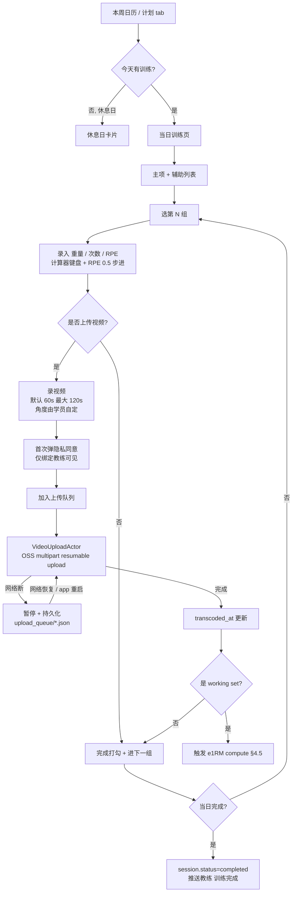
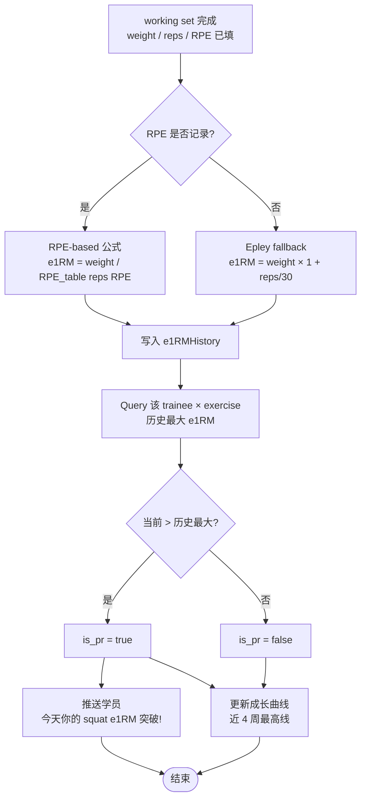
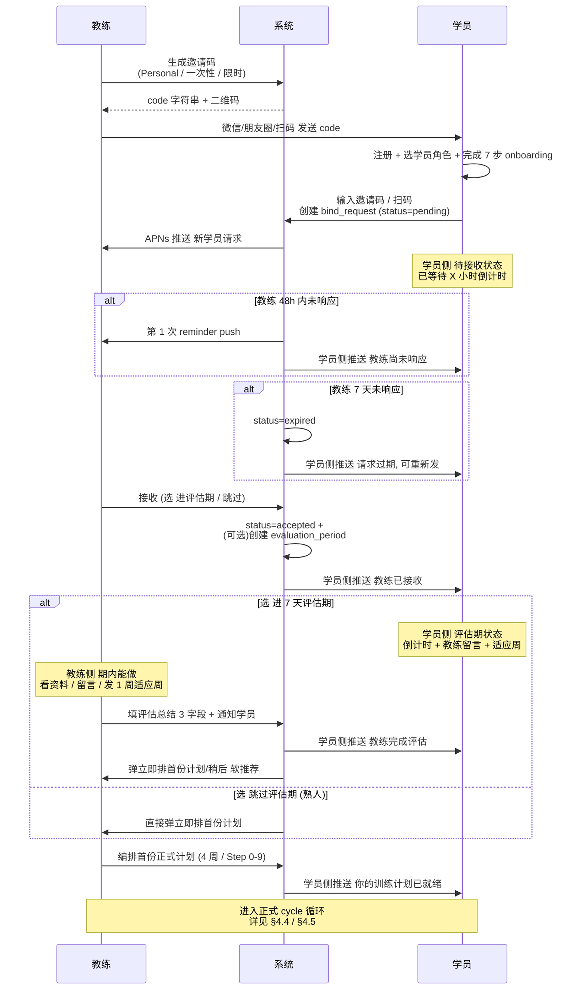

# MeetPR — 信息架构 (IA) v1

> **Status**: Draft v1 · **Date**: 2026-04-27 · 从 [[index|MeetPR 项目入口]] / [[prd|PRD v0.7]] / [[student-onboarding|Onboarding v2.4]] / [[coach-planning|Coach Planning v4.2]] / [[evaluation-workflow|Evaluation v1.1]] / [[data-model|Data Model v1.1]] / [[decisions/003-dual-end-native-architecture|ADR 003 v4]] / [[decisions/005-ios-architecture|ADR 005]] 综合提取
> 关联交付物: [[user-stories|user-stories v1]] (姊妹文档,US-S/US-C 与本 IA tab/page 一一对应)
>
> 本文档**只画结构 + 跳转关系 + 状态机**。Wireframe / 像素级布局 / 视觉规范留 design 阶段。

> [!info] V1 = 单角色单 binary
> 同一 iOS app + 同一 App Store listing。`user.role` (`coach` / `coached_student` / `self_train_student`) 在登录后路由到不同 RootView，**注册后不可切换**。详见 [[decisions/003-dual-end-native-architecture|ADR 003 v4]] + [[decisions/005-ios-architecture|ADR 005]] §2 角色路由。
>
> 多角色单用户、学员 mode toggle、Universal Links 全部 V1.5+ deferred。

---

## 1. 顶层导航 (Top-level Navigation)

### 1.1 启动期路由

App 启动 → AuthFlow → 根据 `user.role` 进入 `CoachRootView` 或 `StudentRootView`。两个 RootView 在 SPM 层互不依赖 (`CoachKit ⊥ StudentKit`，详见 [[decisions/005-ios-architecture|ADR 005]] §1)。



### 1.2 教练端 Tab Bar (5 tab)

```
┌─────────────────────────────────────────────────────────────┐
│  Dashboard │ 学员 │ 编排器 │ 接收队列 ●  │ 我的             │
└─────────────────────────────────────────────────────────────┘
   tab 1       tab 2  tab 3    tab 4 (badge)  tab 5
```

| Tab | 入口 | 主要子页 |
|---|---|---|
| **Dashboard** | 教练落地页 | 学员状态卡片 / 待反馈视频提示 / 评估期超期警告 / 异常学员预警 |
| **学员** | Roster + 详情 | 按状态分组列表 / 单学员详情 / 评估总结编辑 |
| **编排器** | 计划编排入口 | Step 0-9 编排流 / 模板库 / Excel 式 4 周预览 |
| **接收队列** | 新学员请求 | pending 列表 / 弹模态接收 / 拒绝 |
| **我的** | 教练个人中心 | 邀请码管理 / 自定义动作库 / 视频反馈队列 / 订阅 / 设置 |

### 1.3 学员端 Tab Bar — 有教练模式 (4 tab, B2B)

```
┌─────────────────────────────────────────────────────────────┐
│  训练 │ 计划 │ 成长 │ 我的                                  │
└─────────────────────────────────────────────────────────────┘
   tab 1  tab 2  tab 3  tab 4
```

| Tab | 入口 | 主要子页 |
|---|---|---|
| **训练** | 当日训练 (动态) | 5 状态: 未绑定 / 待接收 / 评估期内 / 等待首份计划 / 正式 cycle |
| **计划** | 本周日历 | W1-W4 概览 (4 周模式) / 单天详情 / 历史训练 |
| **成长** | e1RM 时间序列 | 三大项折线 / PR 推送历史 |
| **我的** | 学员个人中心 | 我的资料 4 级权限 / 教练评估总结 / 我的教练 / 设置 |

### 1.4 学员端 Tab Bar — 自己练模式 (4 tab, B2C / Phase 2)

```
┌─────────────────────────────────────────────────────────────┐
│  训练 │ 模板 │ 成长 │ 我的                                  │
└─────────────────────────────────────────────────────────────┘
```

| Tab | 主要子页 |
|---|---|
| **训练** | 当日训练 / 录 set (V1 无视频上传) |
| **模板** | 模板浏览 (10-15 个欧美主流 program) / 参数化生成 / 当前 program 进度 |
| **成长** | e1RM 折线 (与有教练共用组件) |
| **我的** | 自己练 onboarding 修改 / 订阅 (IAP + 7-14 天试用) / 设置 / **B2C marketplace 占位入口** |

> [!warning] B2C marketplace 入口仅占位
> V1 不开放 marketplace 撮合 (V3 才上,详见 [[prd|PRD]] §11.2)。"我的"放"找教练 — 即将开放"占位卡片即可。详见 [[decisions/005-ios-architecture|ADR 005]] §5 (Stage 3-4 边界)。

---

## 2. 教练端页面树

```
CoachRootView (TabView)
│
├── 📊 Dashboard
│   ├── 评估期内学员卡片 (倒计时 + [继续评估])
│   ├── 待反馈视频数提示 → 跳到视频反馈队列
│   ├── 异常学员预警 (3 天未训练 / 卡 W2 / 评估期超期)
│   └── 快捷入口: [+ 排新计划]   [+ 生成邀请码]
│
├── 👥 学员 (Roster)
│   ├── 列表页 (按状态分组)
│   │   ├── 评估期内 (N) → 详情页
│   │   ├── 活跃 (N) → 详情页
│   │   └── 异常 (N) → 详情页
│   └── 学员详情页
│       ├── 学员信息卡片 (29 onboarding 字段 + 视频 + 计划)
│       ├── 当前 cycle (W1-W4 概览, 跳到编排器修改)
│       ├── 历史训练记录 (按周/月)
│       ├── 三大项 e1RM 折线 (教练只看, 不被 PR 推送)
│       ├── 视频历史
│       ├── 评估总结编辑入口 (随时改 + 是否通知学员)
│       └── [解绑学员] (任一方单方触发)
│
├── 🗓️ 编排器
│   ├── Step 0  选学员 (按状态分组下拉)
│   ├── Step 1  选 1 周 / 4 周  (评估期内学员只能选 1 周)
│   ├── Step 2  SBD 频率 → 训练日分配
│   │           [使用模板] / [复制上周] / [从零开始]
│   ├── Step 3  选主项动作 (竞技 / 变式 / 前蹲举 等)
│   ├── Step 4  添加辅助动作 (三标签 facets 筛选)
│   │           ├── 肌群 (9 选): 胸/肩/背/二头/三头/核心/股四/腘绳/臀
│   │           ├── 器械 (4 选): 杠铃/哑铃/器械/自重
│   │           └── 模式 (推 / 拉)
│   ├── Step 5  W1 必填强度 (重量 kg/%1RM 切换  OR  RPE)
│   ├── Step 6  9 种递进/递减规则 (4 周模式)
│   │           重量±/RPE±/组数±/次数± + 自定义
│   ├── Step 7  规则应用周 + Excel 式 4 周预览
│   │           (单元格点击直接修改; 颜色: 绿=W1 手填 / 灰=规则递推或同上周 / 白=手动覆盖)
│   ├── Step 8  发布 → 学员侧推送
│   ├── Step 9  保存模板 (1 周 vs 4 周差异化, 详见 [[coach-planning#Step 9]])
│   └── 模板库 (按 1周/4周 + 天/周 双层归档)
│       ├── 1 周模板  (3天/周, 4天/周, 5天/周)
│       └── 4 周模板  (3天/周, 4天/周, 5天/周)
│
├── 📥 接收队列 (新学员请求)
│   ├── pending 列表 (摘要 9 项)
│   │   姓名/年龄/性别/体重 · 训练年限 · 1RM · 想增强 ·
│   │   训练环境 · 备赛 · 备注 · 资料计数 · 等待时长
│   ├── 卡片 [查看完整资料] → 弹完整 onboarding 详情
│   ├── 卡片 [接收 ▼] → 弹模态 2 选 1
│   │   ├── 进 7 天评估期 (创建 evaluation_period)
│   │   └── 跳过评估期 (熟人, 直接 bind + 进编排器软推荐)
│   └── 卡片 [拒绝] → silent 中性, 学员侧推中性文案
│
└── 👤 我的 (教练个人中心)
    ├── 邀请码管理
    │   ├── Personal 永久码 (default 1 个 + [生成新码] revoke 旧码)
    │   ├── 一次性码 (按需生成, 用 1 次失效, 可加 label)
    │   ├── 限时码 (按需生成, 设过期天数)
    │   └── 老教练推荐码 (V1 公测后开放, V1.5 准备)
    ├── 自定义动作库 (教练私有, 三标签 facets, created_by_coach_id)
    ├── 视频反馈队列 (按时间/学员/紧急度排序; per-set 👍 OR 文本)
    ├── 订阅管理 (按学员数 IAP)
    └── 设置 (推送偏好 / 单位制 / 退出登录 / 注销)
```

### 2.1 教练端 cascade 模态 (跨 tab 跳转)

教练在"学员详情页"修改 Type A 锁定字段 (1RM / 训练日 / 训练环境) 后弹模态 3 选 1，详见 [[coach-planning#§Y Type A 锁定字段 cascade 模态|coach-planning §Y]]。



---

## 3. 学员端页面树

### 3.1 有教练模式 (B2B / Phase 1)

```
StudentRootView (TabView, training_mode='coached')
│
├── 🏋️ 训练 (动态根据绑定状态切换)
│   │
│   ├── 状态 A · 未绑定教练
│   │   ├── 输入邀请码 / 扫码 → 发送绑定请求
│   │   └── (跳过教练 → 切自己练?  V1 不开放, V1.5+)
│   │
│   ├── 状态 B · 待接收 (bind_request.status='pending')
│   │   ├── 等待倒计时 (已等待 X 小时, 教练通常 24h 内响应)
│   │   ├── 已上传资料概览 (3 视频 + 1 计划)
│   │   ├── [取消请求] → status='cancelled'
│   │   ├── 教练 48h 未响应 → 推送 教练尚未响应
│   │   └── 教练 7 天未响应 → 推送 请求过期 + status='expired' + 可重新发
│   │
│   ├── 状态 C · 评估期内 (evaluation_period 进行中)
│   │   ├── 倒计时 + 进度条 (4 天 13 时 / 55%)
│   │   ├── 教练已查看资料 N/M
│   │   ├── 教练留言 (V1 单条; V1.5 多条积累)
│   │   ├── 适应周训练 (如教练发了 1 周轻量计划) [开始训练]
│   │   └── (无 [换教练] 按钮 — V1 marketplace 前不上)
│   │
│   ├── 状态 D · 评估完成 / 等待首份正式计划
│   │   └── "教练正在为你排第一份正式计划, 预计 24 小时内发布"
│   │
│   └── 状态 E · 正式 cycle 进行中 (主流状态)
│       ├── 当日训练 → 训练日页 (详见 §4.4)
│       ├── 本周日历 (W1-W4 进度)
│       └── (24h 内训练日变化高优先级 + 红点)
│
├── 📅 计划
│   ├── 本周日历视图 (训练日 + 休息日)
│   ├── W1-W4 概览 (4 周模式)
│   ├── 单天详情 (主项 + 辅助 + 组数次数 + 强度)
│   └── 历史训练查看 (按周 / 月切换)
│
├── 📈 成长
│   ├── 三大项 e1RM 折线 (近 4 周最高 + 历史曲线)
│   ├── PR 检测推送历史
│   └── 单次训练详情 (跳转)
│
└── 👤 我的
    ├── 我的资料 (4 级修改权限分级, 详见 §3.3)
    │   ├── Type A (锁定 🔒): 1RM / 训练日 / 训练环境 → 联系教练
    │   ├── Type B (可改 + 立即推送教练): 伤病 / 恢复评估
    │   ├── Type C (silent): 想增强肌群 / 比赛日期 / 给教练备注
    │   └── Type D (silent 基础): 身高 / 体重 / 单位制 / 联系方式
    ├── 教练评估总结 (持久查看, 教练后续修改的最新版)
    ├── 我的教练 (头像 + 联系入口)
    ├── 订阅 (V1 学员有教练模式不收费)
    └── 设置 (推送偏好 / 退出登录 / 注销)
```

### 3.2 自己练模式 (B2C / Phase 2)

V1 Phase 2 上线，gated by 里欧 1 周交付 10-15 个欧美主流 program 模板。详见 [[prd|PRD]] §5 P0 #19-23 + [[product-decisions/004-b2c-v1-template-based|PD-004]]。

```
StudentRootView (TabView, training_mode='self_train')
│
├── 🏋️ 训练
│   └── 当日训练 (复用同一组件; V1 无视频上传)
│
├── 📚 模板
│   ├── 模板浏览 (10-15 个欧美主流 program, 里欧整理交付)
│   ├── 模板详情 (来源 / 适合谁 / 周期长度 / deload 规则)
│   ├── 参数化生成 (1RM / 频率 / 周期长度 → 展开为 cycle)
│   ├── 当前 program 进度 (W1-WN 进度条)
│   └── deload 自动插入 (按模板规则)
│
├── 📈 成长
│   └── e1RM 折线 (复用同一组件)
│
└── 👤 我的
    ├── 自己练 onboarding 修改 (1RM / 频率 / 目标)
    ├── 订阅 / 试用期 (7-14 天免费 + IAP)
    ├── 设置
    └── ⓘ 找教练 (即将开放) — V1 marketplace 占位
```

> [!info] B2C V1 不做视频上传
> 自己练学员 V1 不能上传训练视频 (无教练接收侧)。V1.5 评估"复盘视频"独立场景。详见 [[prd|PRD]] §5 P0 #23。

### 3.3 我的资料 4 级权限关系



---

## 4. 关键流程状态机

### 4.1 学员 7 步 Onboarding

详见 [[student-onboarding|Onboarding v2.4]]。



### 4.2 接收队列 + 评估期 funnel (跨端)

详见 [[evaluation-workflow|Evaluation v1.1]] §3-§5。



### 4.3 7 天评估期硬截止



### 4.4 一周计划 → 训练日 → 录 set → 录视频 → 上传



### 4.5 PR 检测 (e1RM 重塑, 议题 6)

详见 [[coach-planning#§α e1RM 计算|coach-planning §α]] + [[evaluation-workflow#0.1 v1 → v1.1 update|evaluation-workflow §0.1]]。



> [!info] PR 重塑要点 (议题 6)
> - **1RM 字段不被 PR 改** (锁定字段, 仅 onboarding / 教练 / V2 比赛触发)
> - **e1RM 是独立时间序列** (每次训练后系统自动 recompute)
> - **教练侧不被 PR 推送** (教练打开学员曲线能看到增长即可)

---

## 5. 跨端 Funnel: 邀请码 → 绑定 → 评估期 → 首份计划

完整跨端串联 (教练 + 学员 + 系统三视角)：



---

## 6. 跨页面跳转关系汇总

| 来源 | 触发 | 目标 |
|---|---|---|
| 教练 Dashboard 评估期警告卡片 | 点 | 学员详情页 |
| 教练 Dashboard [+ 排新计划] | 点 | 编排器 Step 0 |
| 教练 Dashboard [+ 生成邀请码] | 点 | 我的 → 邀请码管理 |
| 教练接收队列 [接收 ▼] 选跳过 | 模态 | 编排器 Step 0 (预填该学员) |
| 教练接收队列 [接收 ▼] 选评估期 | 模态 | 学员详情 (评估期 placeholder) |
| 教练评估总结 [完成+通知学员] | 软推荐 | 编排器 Step 0 (预填) |
| 教练学员详情改 Type A 字段 | cascade ① | 编排器 Step 1 (加载当前 cycle) |
| 教练学员详情改 Type A 字段 | cascade ② | 学员侧 normal 推送 |
| 教练学员详情改 Type A 字段 | cascade ③ | cycle 终止 + 学员侧推送 |
| 教练编排 Step 9 [保存模板] | 完成 | 我的 → 模板库 |
| 教练视频反馈队列项 [👍] | 1-tap | 学员侧推送 (无跳转, queue 减一) |
| 教练视频反馈队列项 [文本反馈] | 弹文本框 | 同上 + 学员侧推送 |
| 学员训练 tab 状态 A 输入邀请码 | 提交 | 训练 tab 状态 B (待接收) |
| 学员训练 tab 状态 B [取消请求] | 确认 | 训练 tab 状态 A (未绑定) |
| 学员评估期完成推送 | 点 | 我的资料 → 评估总结摘要页 |
| 学员评估总结摘要 [展开看完整] | 点 | 评估总结全文页 (3 字段) |
| 学员训练 tab 当日训练 | 点某组 | set 录入页 |
| 学员 set 录入页 [+ 录视频] | 点 | 视频录制页 → 上传队列 |
| 学员训练完成 | 自动 | e1RM 重算 + (如 PR) 推送 |
| 学员我的 → 教练评估总结 | 点 | 评估总结全文页 |
| 学员我的 → 我的教练 [联系] | 点 | (V1: 微信 deep link / V1.5+: 内置 IM) |
| 学员我的 → 我的教练 [解绑] | 确认 | 训练 tab 状态 A (未绑定) + 历史保留 |

---

## 7. V1 不在 IA 范围 / V1.5+ deferred

> [!warning] 以下页面 V1 不出现
> - **多角色身份切换 tab** (账号设置内): V1.5+ 触发条件后再做。详见 [[decisions/003-dual-end-native-architecture|ADR 003 v4]]
> - **学员 mode toggle** (有教练 → 自己练): V1.5 评估教练流失场景再加，详见 [[decisions/005-ios-architecture|ADR 005]] §5
> - **B2C marketplace 撮合页** (教练浏览 / 订阅): V3 才上, V1 仅"我的"占位卡片
> - **教练端跨学员模板批量下发**: V1.5 候选, 详见 [[prd|PRD]] §5 P1
> - **学员端 [换教练] 按钮** (评估期 / 正式 cycle 中): marketplace 成熟前不上
> - **微信登录**: Apple §4.8 合规 + WeChat OpenSDK 集成研究, V1.5 启动
> - **教练协作 / 团队套餐**: V2, 详见 [[prd|PRD]] §5 P2
> - **比赛 / Meet 追踪**: V2 (虽然名字里有 meet)
> - **未成年学员模式 + 监护人同意**: V2 涉及合规复杂度

---

## 8. 关联文档索引

| 文档 | IA 中体现的章节 |
|---|---|
| [[prd\|PRD v0.7]] §5 P0 | 27 项 P0 在本 IA 各 tab 都有对应页 (详见姊妹文档 [[user-stories]] 覆盖矩阵) |
| [[student-onboarding\|Onboarding v2.4]] | §4.1 7 步流 + §3.3 我的资料 4 级权限 + §3.1 训练 tab 状态 B/C/D |
| [[coach-planning\|Coach Planning v4.2]] | §2 编排器 Step 0-9 + §2.1 cascade 模态 + §4.5 e1RM + 教练 Tab 5 视频反馈队列 |
| [[evaluation-workflow\|Evaluation v1.1]] | §4.2 接收 funnel + §4.3 7 天评估期 + §5 跨端 sequence |
| [[data-model\|Data Model v1.1]] | §4.x 状态机驱动的实体生命周期 (bind_request / evaluation_period / e1RMHistory) |
| [[decisions/003-dual-end-native-architecture\|ADR 003 v4]] | §1.1 启动期路由 (V1 单角色锁死) |
| [[decisions/005-ios-architecture\|ADR 005]] | §1.1 启动期路由 (Session + RootView) + §1.2-§1.4 Tab Bar 与 SPM 包对应 (CoachKit / StudentKit) |
| [[user-stories\|user-stories v1]] | 每个 page / state 至少 1 条对应 US (US-S-XXX 学员; US-C-XXX 教练) |

---

## 9. 待解决 (design 阶段补)

- [ ] 训练日页与"录视频"页的具体 UX 交互 (modal vs push, 录完是否自动回训练日)
- [ ] B2C 模板浏览页的卡片样式 (Phase 2 design 阶段)
- [ ] 教练 Dashboard 是否要含 e1RM 异常预警卡片 (V1.5 评估)
- [ ] 学员"我的教练"页的联系入口形态 (V1: 微信 deep link / V1.5: 内置 IM)
- [ ] 接收队列 [查看完整资料] 是 push 还是 modal (UX review)
- [ ] 评估期 状态 D (等待首份计划) 超时逻辑 (教练评估完后 7 天没排首份计划，学员看到什么)
- [ ] 编排器 Excel 预览的横向滚动 vs 纵向滚动 (4 列 × N 行布局, 可能需要 freeze 第一列)

---

## 10. 来源

- [[prd|PRD v0.7]] §5 功能清单 P0 (27 项)
- [[student-onboarding|学员端 Onboarding v2.4]] 7 步流 + §A/§B/§C/§D
- [[coach-planning|教练端编排架构 v4.2]] Step 0-9 + §X/§Y/§Z + §α/§β
- [[evaluation-workflow|评估期工作流 v1.1]] §1-§7
- [[data-model|数据模型 v1.1]] 实体关系
- [[decisions/003-dual-end-native-architecture|ADR 003 v4]] 单角色锁死决议
- [[decisions/004-backend-selection|ADR 004]] 推送 SLA ≤ 30s
- [[decisions/005-ios-architecture|ADR 005]] §1-§4 模块切分 + 角色路由 + 持久化 + 横切
